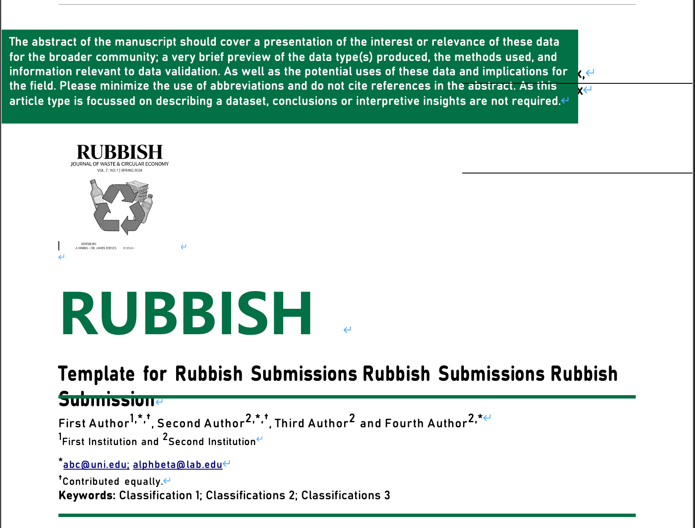

<h1 align="center">Rubbish LaTeX Template</h1>

<p align="center">
  
  
  
  
  
</p>

<p align="center">
  The unofficial, community-provided LaTeX template for <b><i>Rubbish</i></b>—the pioneering open-access,<br>
  peer-ignored journal hosted on Xiaohongshu (小红书), indexed by the <i>Web of Absurd</i> with an <b>AIF of 100</b>.
</p>

<p align="center">
  <a href="rubbish-template.pdf"><b>View Template Preview (PDF)</b></a>
</p>

---

## Why does this exist?

The official *Rubbish* submission template is a Microsoft Word `.doc` file---not `.docx`, but the binary `.doc` format that Microsoft deprecated in 2007. On macOS, it renders with:

- Missing images (WMF format, Windows-only)
- Collapsed formatting and broken layouts
- Metadata scattered across random pages

<details>
<summary><b>Exhibit A: The .doc template on macOS (click to witness the horror)</b></summary>
<br>
<p align="center">
  
</p>
<p align="center"><i>The abstract has fled to the top of the page. The logo has lost its colour. The title stutters.<br>Viewer discretion is advised.</i></p>
</details>

WPS Office (Kingsoft) was evaluated as an alternative but proved equally inadequate, introducing font substitution artifacts and watermarks.

This LaTeX template was forensically reconstructed from the original `.doc` binary and faithfully reproduces the journal's visual identity while actually working on all operating systems.

## Features

- Cross-platform compilation (macOS, Windows, Linux)
- [Overleaf](https://www.overleaf.com) compatible (zero installation)
- Separated `.cls` class file + `.tex` content for clean authoring
- Two-column body layout with single-column title block
- Green accent color (`#007146`) matching the original design
- Styled abstract box and MID info box
- Section headings in bold italic green (3 levels)
- Baskerville body text with proper paragraph indentation
- Code blocks with green-accented syntax highlighting (`listings`)
- CJK (Chinese/Japanese) text support via `xeCJK`
- Self-documenting: compiles into its own user guide

## Quick Start

### Option 1: Overleaf (Recommended)

1. Download this repository as a ZIP
2. Go to [Overleaf](https://www.overleaf.com) → New Project → Upload Project
3. Upload the ZIP
4. Set compiler to **XeLaTeX** (Menu → Compiler → XeLaTeX)
5. Compile and start writing your rubbish

> **Note:** On Overleaf, change fonts in `rubbish.cls`:
> Baskerville → `TeX Gyre Pagella`, Georgia → `TeX Gyre Termes`

### Option 2: Local Compilation

```bash
# Requires XeLaTeX (ships with TeX Live / MacTeX / MiKTeX)
xelatex rubbish-template.tex
xelatex rubbish-template.tex   # run twice for cross-references
```

**Required fonts** (pre-installed on macOS; install manually on Linux):
- Times New Roman (title, headers)
- Baskerville (body text)
- Georgia (email addresses)

## File Structure

```
rubbish-template/
├── rubbish.cls              # Document class — all styling lives here
├── rubbish-template.tex     # The template — edit this
├── rubbish-template.pdf     # Compiled preview
├── logo.png                 # Journal logo (extracted from original .doc)
├── LICENSE                  # MIT License
├── CONTRIBUTING.md
├── .gitignore
└── README.md
```

## Usage

1. Open `rubbish-template.tex`
2. Update the metadata commands in the preamble:
   ```latex
   \rubbishtitle{Your Paper Title Here}
   \rubbishmid{MID: xx.xxxx/xxxx}
   \rubbishreceived{Received 1st January 2026,}
   \rubbishaccepted{Accepted 1st January 2026}
   \rubbishtype{Research Article}
   ```
3. Set your authors and affiliations:
   ```latex
   \rubbishauthors{
     Alice\textsuperscript{1,*},
     Bob\textsuperscript{2}
   }
   \rubbishaffiliations{
     \textsuperscript{1}University of Rubbish
     and \textsuperscript{2}Institute of Waste\\[1pt]
     \textsuperscript{*}\,alice@rubbish.edu
   }
   ```
4. Write your content inside `\begin{rubbishbody}...\end{rubbishbody}`
5. Compile with XeLaTeX (twice for cross-references)

The compiled template itself serves as a comprehensive user guide — it documents every formatting feature (sections, figures, tables, equations, code blocks, footnotes, hyperlinks, CJK text, etc.).

## Contributing

Pull requests are welcome. Given the journal's editorial standards, we suspect all pull requests will be merged without review.

## Citation

If you use this template, you may cite the accompanying paper:

> 学术小狐狐 and Claude Opus 4.6. "The Official LaTeX Template for *Rubbish*: Because the `.doc` Template is, Well, Rubbish." *Rubbish*, 2026.

## License

MIT License. In the spirit of the circular economy, feel free to fork, modify, and redistribute.

---

*One person's rubbish is another person's publication---but every person deserves a template that actually works.*